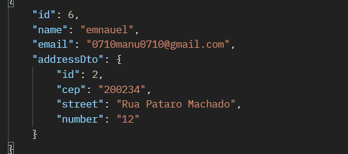

# micro-servi-os-employee




## Instruções de Execução

### Pré-requisitos:
- JDK 17 ou superior instalado
- Maven instalado
- Postman instalado (ou ferramenta similar para testar APIs)

### Passo 1: Clonar o Repositório
Clone o repositório do projeto para sua máquina local.

### Passo 2: Executar o Eureka Server
1. Navegue até o diretório do projeto "discovery-service".
2. Execute o seguinte comando para iniciar o servidor Eureka:
   ```
   mvn spring-boot:run
   ```

### Passo 3: Executar os Aplicativos Employee e Address
Para cada aplicativo (Employee Service e Address Service), siga estes passos:
1. Navegue até o diretório do aplicativo desejado.
2. Execute o seguinte comando para iniciar o aplicativo:
   ```
   mvn spring-boot:run
   ```

### Passo 4: Testar a Comunicação com o Postman
1. Abra o Postman.
2. Crie uma nova solicitação e defina o método HTTP adequado (GET, POST, PUT, DELETE).
3. Utilize a URL base do aplicativo desejado, por exemplo:
  - Para o Employee Service: `http://localhost:8080`
  - Para o Address Service: `http://localhost:8082`
4. Adicione o caminho do endpoint específico que deseja testar.
5. Adicione os parâmetros necessários (se aplicável) e envie a solicitação.
6. Observe a resposta recebida para verificar se a comunicação entre os serviços está funcionando corretamente.

### Exemplo de Teste no Postman
- **Endpoint do Employee Service:** `http://localhost:8080/employees/{id}`
  - **Método GET:** Recupera os detalhes do funcionário com o ID fornecido.
  - **Método POST:** Registra um novo funcionário.
  - **Exemplo de URL GET:** `http://localhost:8080/employees/1`
- **Endpoint do Address Service:** `http://localhost:8082/address/{employeeId}`
  - **Método GET:** Recupera o endereço associado ao ID do funcionário fornecido.
  - **Método POST:** Registra um novo endereço.
  - **Exemplo de URL GET:** `http://localhost:8082/address/1`

Certifique-se de adaptar os números de porta e os caminhos dos endpoints conforme necessário para corresponder à configuração específica do seu ambiente.

Este guia fornece instruções detalhadas sobre como executar e testar os aplicativos e o servidor Eureka para garantir uma comunicação adequada entre eles.
